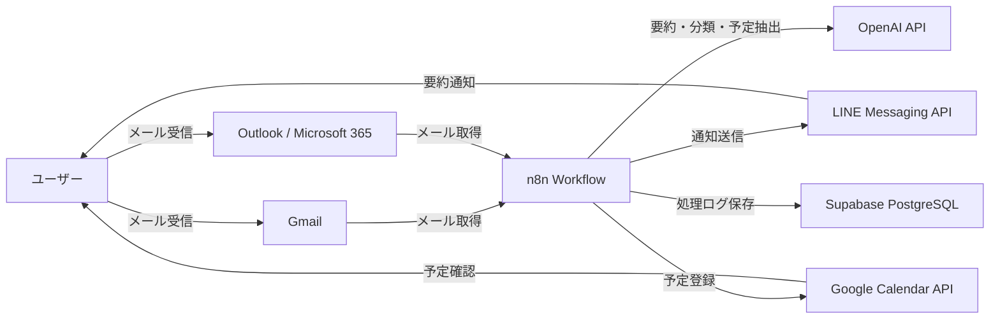
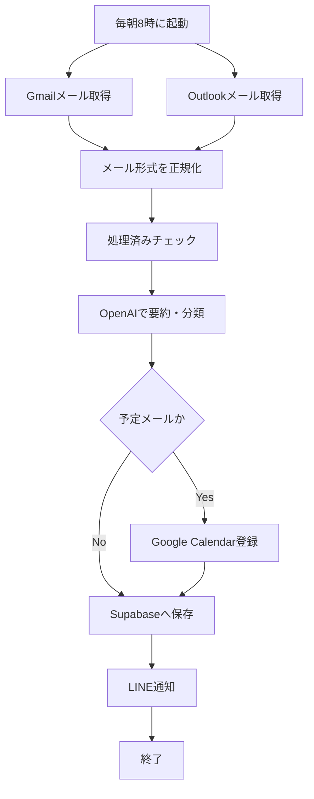
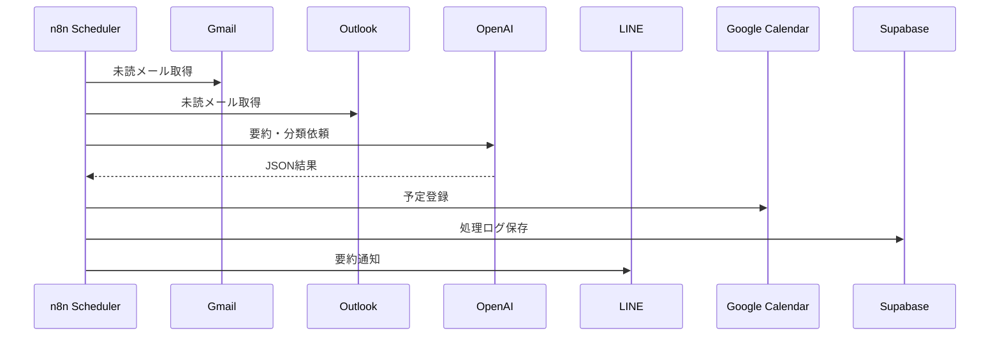
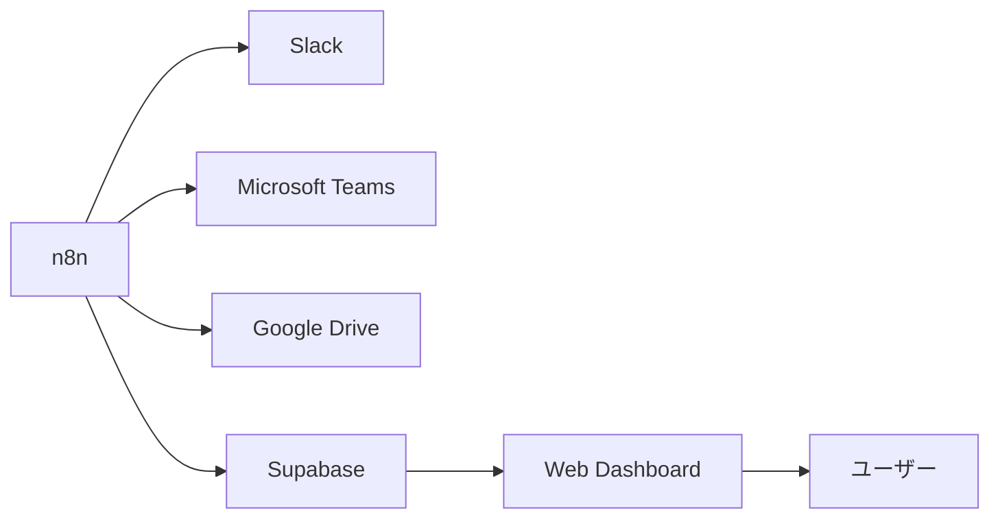

# システム構成図

## 1. 概要

本ドキュメントでは、AIメールアシスタントのシステム全体構成を定義する。

本システムは、GmailおよびOutlookからメールを取得し、n8n上でワークフローを実行する。取得したメールはOpenAI APIで要約・分類・予定抽出を行い、結果をLINEへ通知する。予定情報を含むメールについてはGoogle Calendarへ自動登録し、処理結果はSupabaseへ保存する。

---

## 2. 全体構成



---

## 3. コンポーネント一覧

| コンポーネント | 役割 |
|---|---|
| Gmail | メール取得元 |
| Outlook / Microsoft 365 | メール取得元 |
| n8n | ワークフロー実行基盤 |
| OpenAI API | メール要約・分類・予定抽出 |
| LINE Messaging API | ユーザーへの通知 |
| Google Calendar API | 予定の自動登録 |
| Supabase | 処理ログ・エラーログ・重複判定データの保存 |
| GitHub | 設計書・n8nワークフロー・設定ファイルの管理 |

---

## 4. 処理フロー概要



---

## 5. データの流れ

### 5.1 メール取得

GmailおよびOutlookから対象メールを取得する。

対象メールは以下とする。

- 未読メール
- 直近24時間以内のメール
- 受信トレイ配下のメール

取得後、GmailとOutlookで異なるレスポンス形式を共通のメールオブジェクトへ変換する。

---

### 5.2 正規化後のメールデータ

```json
{
  "source": "gmail",
  "messageId": "string",
  "threadId": "string",
  "sender": "string",
  "subject": "string",
  "body": "string",
  "receivedAt": "2026-07-11T08:00:00+09:00"
}
```

| 項目 | 説明 |
|---|---|
| source | gmail または outlook |
| messageId | メールサービス上のメールID |
| threadId | スレッドID。Outlookで取得できない場合はnull |
| sender | 差出人 |
| subject | 件名 |
| body | 本文 |
| receivedAt | 受信日時 |

---

### 5.3 AI処理結果

OpenAI APIにメール情報を渡し、以下の形式で結果を受け取る。

```json
{
  "summary": "メール内容の要約",
  "priority": "High",
  "category": "schedule",
  "requiresAction": true,
  "isSchedule": true,
  "event": {
    "title": "打ち合わせ",
    "startDateTime": "2026-07-12T10:00:00+09:00",
    "endDateTime": "2026-07-12T11:00:00+09:00",
    "location": "オンライン",
    "description": "メール本文から抽出した予定内容"
  }
}
```

---

## 6. 外部サービス連携

### 6.1 Gmail

| 項目 | 内容 |
|---|---|
| 用途 | Gmailメール取得 |
| 認証方式 | OAuth2 |
| 使用方式 | n8n GmailノードまたはGmail API |
| 主な取得項目 | 件名、差出人、本文、受信日時、メールID |

---

### 6.2 Outlook / Microsoft Graph

| 項目 | 内容 |
|---|---|
| 用途 | Outlookメール取得 |
| 認証方式 | OAuth2 |
| 使用方式 | n8n Microsoft OutlookノードまたはMicrosoft Graph API |
| 主な取得項目 | 件名、差出人、本文、受信日時、メールID、Webリンク |

---

### 6.3 OpenAI API

| 項目 | 内容 |
|---|---|
| 用途 | メール要約・分類・予定抽出 |
| 入力 | 件名、差出人、本文、受信日時 |
| 出力 | 要約、重要度、カテゴリ、予定情報 |
| 注意点 | JSON形式で安定して返却させるプロンプト設計が必要 |

---

### 6.4 LINE Messaging API

| 項目 | 内容 |
|---|---|
| 用途 | メール要約の通知 |
| 通知先 | 個人LINEアカウント |
| 通知内容 | 重要メール、通常メール、予定登録結果、エラー概要 |

---

### 6.5 Google Calendar API

| 項目 | 内容 |
|---|---|
| 用途 | 予定メールの自動登録 |
| 登録条件 | 予定タイトルと開始日時が取得できていること |
| 登録内容 | タイトル、日時、場所、説明、元メール情報 |

---

### 6.6 Supabase

| 項目 | 内容 |
|---|---|
| 用途 | 処理ログ保存、重複判定、エラーログ保存 |
| DB | PostgreSQL |
| 主なテーブル | mail_logs, calendar_logs, error_logs |

---

## 7. 責務分離

| 領域 | 責務 |
|---|---|
| n8n | ワークフロー制御、API連携、条件分岐 |
| OpenAI | 要約、分類、予定情報抽出 |
| Supabase | 処理履歴、重複処理防止、エラー保存 |
| LINE | ユーザー通知 |
| Google Calendar | 予定管理 |
| GitHub | 設計書、設定ファイル、ワークフロー定義の管理 |

---

## 8. 実行タイミング

初期MVPでは、n8nのスケジュールトリガーを使用して毎日8時に実行する。



---

## 9. セキュリティ構成

### 9.1 秘密情報の管理

APIキーやOAuthトークンはGitHubへコミットしない。

管理対象は以下とする。

- OpenAI API Key
- LINE Channel Access Token
- Gmail OAuth Credential
- Microsoft OAuth Credential
- Google Calendar OAuth Credential
- Supabase URL
- Supabase Service Role Key
- n8n Encryption Key

### 9.2 管理方法

| 情報 | 管理場所 |
|---|---|
| APIキー | `.env` またはn8n Credentials |
| OAuth認証情報 | n8n Credentials |
| Supabase接続情報 | `.env` またはn8n Credentials |
| サンプル環境変数 | `.env.example` |

---

## 10. 障害時の考え方

一部サービスが失敗しても、可能な範囲で処理を継続する。

| 障害 | 方針 |
|---|---|
| Gmail取得失敗 | Outlook処理は継続 |
| Outlook取得失敗 | Gmail処理は継続 |
| OpenAI失敗 | 対象メールを未処理として保存 |
| Google Calendar登録失敗 | LINE通知に失敗情報を含める |
| LINE通知失敗 | Supabaseへエラーログ保存 |
| Supabase保存失敗 | n8n実行ログで確認 |

---

## 11. MVP構成

MVPでは、以下の構成で実装する。

```text
Gmail
Outlook
↓
n8n
↓
OpenAI API
↓
LINE Messaging API
Google Calendar API
Supabase
```

Web画面はMVPでは作成しない。

---

## 12. 将来拡張構成

MVP後は、以下の拡張を検討する。



将来的に追加する可能性がある機能は以下とする。

- Webダッシュボード
- Slack通知
- Teams通知
- 添付ファイル解析
- 請求書PDFのGoogle Drive保存
- メール返信文生成
- 複数ユーザー対応

---

## 13. 設計方針

本システムでは、以下の方針を採用する。

- 最初はn8n中心で実装する
- GmailとOutlookの差分は正規化処理で吸収する
- AIの出力はJSON形式に統一する
- 重複処理防止はSupabaseで管理する
- 予定登録はGoogle Calendarに限定する
- UIはMVPでは作らない
- 設計書、環境変数例、ワークフロー定義はGitHubで管理する