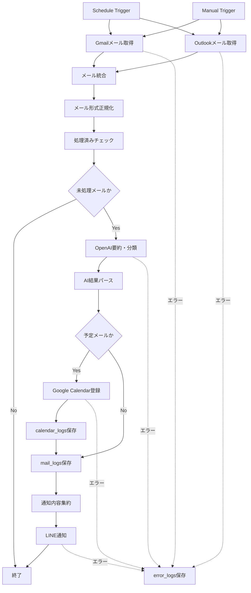
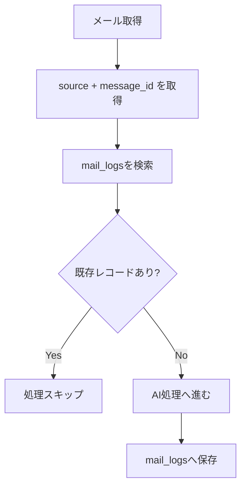

# n8nワークフロー設計

## 1. 概要

本ドキュメントでは、AIメールアシスタントにおけるn8nワークフローの設計を定義する。

本ワークフローは、GmailおよびOutlookからメールを取得し、OpenAI APIで要約・分類・予定抽出を行い、LINE通知、Google Calendar登録、Supabase保存を実行する。

MVPでは、Webアプリケーションは作成せず、n8nを中心に外部サービスを連携する。

---

## 2. ワークフロー名

```text
AI Mail Assistant - Daily Summary
```

---

## 3. 実行タイミング

MVPでは、毎日朝8時に実行する。

| 項目 | 内容 |
|---|---|
| 実行方式 | Schedule Trigger |
| 実行頻度 | 毎日 |
| 実行時刻 | 08:00 |
| タイムゾーン | Asia/Tokyo |
| 手動実行 | テスト用に許可 |

---

## 4. 全体フロー



---

## 5. ノード一覧

| ID | ノード名 | 種別 | 役割 |
|---|---|---|---|
| N-001 | Schedule Trigger | Trigger | 毎朝8時にワークフローを起動 |
| N-002 | Manual Trigger | Trigger | 手動テスト実行 |
| N-003 | Get Gmail Messages | Gmail | Gmailから対象メールを取得 |
| N-004 | Get Outlook Messages | Microsoft Outlook / HTTP Request | Outlookから対象メールを取得 |
| N-005 | Merge Mail Sources | Merge | GmailとOutlookの結果を統合 |
| N-006 | Normalize Mail Object | Code | メール形式を共通形式へ変換 |
| N-007 | Check Processed Mail | Supabase / PostgreSQL | 処理済みメールか確認 |
| N-008 | Filter Unprocessed Mail | IF | 未処理メールのみ後続へ通す |
| N-009 | Generate AI Summary | OpenAI / HTTP Request | 要約・分類・予定抽出 |
| N-010 | Parse AI Result | Code | AI出力JSONを検証・整形 |
| N-011 | Check Schedule Mail | IF | 予定メールか判定 |
| N-012 | Create Calendar Event | Google Calendar | Google Calendarへ予定登録 |
| N-013 | Save Calendar Log | Supabase / PostgreSQL | カレンダー登録結果を保存 |
| N-014 | Save Mail Log | Supabase / PostgreSQL | メール処理結果を保存 |
| N-015 | Aggregate Notification | Code | LINE通知文を作成 |
| N-016 | Send LINE Message | HTTP Request | LINEへ通知送信 |
| N-017 | Save Error Log | Supabase / PostgreSQL | エラー情報を保存 |
| N-018 | Mark Gmail as Read | Gmail | 処理済みGmailを既読化 |
| N-019 | Mark Outlook as Read | Microsoft Outlook / HTTP Request | 処理済みOutlookを既読化 |

---

## 6. 入出力データ設計

## 6.1 正規化前のメールデータ

GmailとOutlookでは、取得データの構造が異なる。

### Gmail例

```json
{
  "id": "gmail-message-id",
  "threadId": "gmail-thread-id",
  "snippet": "本文の一部",
  "payload": {
    "headers": []
  },
  "internalDate": "1780000000000"
}
```

### Outlook例

```json
{
  "id": "outlook-message-id",
  "subject": "件名",
  "from": {
    "emailAddress": {
      "name": "送信者名",
      "address": "sender@example.com"
    }
  },
  "receivedDateTime": "2026-07-11T23:00:00Z",
  "body": {
    "contentType": "html",
    "content": "本文"
  },
  "webLink": "https://outlook.office.com/..."
}
```

---

## 6.2 正規化後のメールオブジェクト

後続処理では、GmailとOutlookを以下の共通形式に変換する。

```json
{
  "source": "gmail",
  "messageId": "string",
  "threadId": "string",
  "senderName": "string",
  "senderEmail": "sender@example.com",
  "subject": "string",
  "body": "string",
  "receivedAt": "2026-07-12T08:00:00+09:00",
  "webLink": "string",
  "isRead": false
}
```

| 項目 | 説明 |
|---|---|
| source | gmail または outlook |
| messageId | 各メールサービス上のメールID |
| threadId | スレッドID。取得できない場合はnull |
| senderName | 差出人名 |
| senderEmail | 差出人メールアドレス |
| subject | 件名 |
| body | 本文 |
| receivedAt | 受信日時 |
| webLink | メールを開くためのURL。取得できない場合はnull |
| isRead | 既読状態 |

---

## 6.3 AI処理結果

OpenAI APIの出力は以下の形式とする。

```json
{
  "summary": "メール内容の要約",
  "priority": "High",
  "category": "schedule",
  "requiresAction": true,
  "isSchedule": true,
  "event": {
    "title": "A社打ち合わせ",
    "startDateTime": "2026-07-15T10:00:00+09:00",
    "endDateTime": "2026-07-15T11:00:00+09:00",
    "location": "オンライン",
    "description": "メール本文から抽出した予定内容"
  }
}
```

---

## 7. ノード詳細設計

## 7.1 N-001 Schedule Trigger

### 役割

毎朝8時にワークフローを自動実行する。

### 設定

| 項目 | 値 |
|---|---|
| Trigger Type | Cron / Schedule |
| Frequency | Daily |
| Time | 08:00 |
| Timezone | Asia/Tokyo |

---

## 7.2 N-002 Manual Trigger

### 役割

開発中・検証中に手動でワークフローを実行する。

### 使用タイミング

- Gmail接続テスト
- Outlook接続テスト
- OpenAIプロンプト検証
- LINE通知テスト
- Google Calendar登録テスト

---

## 7.3 N-003 Get Gmail Messages

### 役割

Gmailから対象メールを取得する。

### 取得条件

```text
in:inbox is:unread newer_than:1d
```

### 取得対象

- 未読メール
- 受信トレイ配下
- 直近24時間以内

### 取得項目

- messageId
- threadId
- subject
- sender
- receivedAt
- body
- snippet

### 備考

MVPでは添付ファイルの取得は行わない。

---

## 7.4 N-004 Get Outlook Messages

### 役割

Outlookから対象メールを取得する。

### 取得条件

- 受信トレイ配下
- 未読メール
- 直近24時間以内

### Microsoft Graph APIを使用する場合の例

```http
GET /me/mailFolders/inbox/messages
```

### フィルタ条件例

```text
isRead eq false and receivedDateTime ge {24時間前の日時}
```

### 取得項目

- id
- subject
- from
- receivedDateTime
- body
- webLink
- isRead

---

## 7.5 N-005 Merge Mail Sources

### 役割

GmailとOutlookから取得したメールを1つの配列に統合する。

### Merge方式

```text
Append
```

### 出力

```json
[
  {
    "source": "gmail",
    "raw": {}
  },
  {
    "source": "outlook",
    "raw": {}
  }
]
```

---

## 7.6 N-006 Normalize Mail Object

### 役割

GmailとOutlookのメールデータを共通形式へ変換する。

### 処理内容

- `source` の付与
- 件名の抽出
- 差出人の抽出
- 本文のHTML除去
- 受信日時のJST変換
- 不足項目のnull補完

### 出力形式

```json
{
  "source": "gmail",
  "messageId": "string",
  "threadId": "string",
  "senderName": "string",
  "senderEmail": "string",
  "subject": "string",
  "body": "string",
  "receivedAt": "2026-07-12T08:00:00+09:00",
  "webLink": null,
  "isRead": false
}
```

### Codeノードの疑似コード

```js
return items.map(item => {
  const source = item.json.source;

  if (source === 'gmail') {
    return {
      json: {
        source: 'gmail',
        messageId: item.json.id,
        threadId: item.json.threadId ?? null,
        senderName: item.json.senderName ?? null,
        senderEmail: item.json.senderEmail ?? null,
        subject: item.json.subject ?? '(件名なし)',
        body: item.json.body ?? item.json.snippet ?? '',
        receivedAt: item.json.receivedAt,
        webLink: null,
        isRead: false
      }
    };
  }

  if (source === 'outlook') {
    return {
      json: {
        source: 'outlook',
        messageId: item.json.id,
        threadId: null,
        senderName: item.json.from?.emailAddress?.name ?? null,
        senderEmail: item.json.from?.emailAddress?.address ?? null,
        subject: item.json.subject ?? '(件名なし)',
        body: item.json.body?.content ?? '',
        receivedAt: item.json.receivedDateTime,
        webLink: item.json.webLink ?? null,
        isRead: item.json.isRead ?? false
      }
    };
  }

  return item;
});
```

---

## 7.7 N-007 Check Processed Mail

### 役割

同じメールを複数回処理しないため、Supabase上の `mail_logs` を確認する。

### 検索条件

```sql
SELECT id
FROM mail_logs
WHERE source = $1
  AND message_id = $2
LIMIT 1;
```

### 判定

| 結果 | 後続処理 |
|---|---|
| レコードあり | 処理済みとしてスキップ |
| レコードなし | AI処理へ進む |

---

## 7.8 N-008 Filter Unprocessed Mail

### 役割

未処理メールのみ後続処理へ流す。

### 条件

```text
processed = false
```

---

## 7.9 N-009 Generate AI Summary

### 役割

OpenAI APIを使用して、メール要約・分類・予定抽出を行う。

### 入力

```json
{
  "sender": "sender@example.com",
  "subject": "打ち合わせについて",
  "body": "本文",
  "receivedAt": "2026-07-12T08:00:00+09:00"
}
```

### 出力

```json
{
  "summary": "打ち合わせの日程調整に関するメールです。",
  "priority": "High",
  "category": "schedule",
  "requiresAction": true,
  "isSchedule": true,
  "event": {
    "title": "打ち合わせ",
    "startDateTime": "2026-07-15T10:00:00+09:00",
    "endDateTime": "2026-07-15T11:00:00+09:00",
    "location": "オンライン",
    "description": "打ち合わせの日程調整"
  }
}
```

### 注意事項

- JSONのみを返すようにプロンプトで制御する
- 本文が長い場合は、文字数を制限して送信する
- 予定日時が曖昧な場合は `isSchedule=false` とする
- 重要度判定基準はプロンプト設計書に記載する

---

## 7.10 N-010 Parse AI Result

### 役割

OpenAI APIから返却されたJSONを検証・整形する。

### 検証項目

- JSONとしてパース可能か
- `summary` が存在するか
- `priority` が High / Medium / Low のいずれかか
- `category` が定義済みカテゴリか
- `isSchedule=true` の場合、`event.startDateTime` が存在するか

### 不正な場合の扱い

| 状態 | 対応 |
|---|---|
| JSONパース失敗 | error_logsへ保存 |
| priority不正 | Mediumに補正 |
| category不正 | otherに補正 |
| event不足 | isSchedule=falseに補正 |

---

## 7.11 N-011 Check Schedule Mail

### 役割

AI処理結果をもとに、Google Calendar登録が必要か判定する。

### 条件

```text
isSchedule = true
event.title is not empty
event.startDateTime is not empty
```

---

## 7.12 N-012 Create Calendar Event

### 役割

予定情報をGoogle Calendarへ登録する。

### 登録条件

- `isSchedule=true`
- `event.title` が存在する
- `event.startDateTime` が存在する
- 同一メールIDで未登録である

### 登録内容

| Google Calendar項目 | 設定値 |
|---|---|
| summary | event.title |
| start.dateTime | event.startDateTime |
| end.dateTime | event.endDateTime |
| location | event.location |
| description | event.description + 元メール情報 |

### 終了日時の補完

`event.endDateTime` がない場合は、`event.startDateTime` の1時間後を設定する。

---

## 7.13 N-013 Save Calendar Log

### 役割

Google Calendar登録結果を `calendar_logs` に保存する。

### 保存項目

- mail_log_id
- source
- message_id
- google_event_id
- status
- error_message
- created_at

---

## 7.14 N-014 Save Mail Log

### 役割

メールごとの処理結果を `mail_logs` に保存する。

### 保存項目

- source
- message_id
- thread_id
- sender_name
- sender_email
- subject
- received_at
- summary
- priority
- category
- requires_action
- is_schedule
- processed_status
- error_message
- processed_at

---

## 7.15 N-015 Aggregate Notification

### 役割

LINE通知用メッセージを作成する。

### 集約単位

1回のワークフロー実行単位で集約する。

### 通知項目

- 処理日時
- 処理件数
- 重要メール
- 通常メール
- 予定登録結果
- エラー概要

### 通知文例

```text
今日のメール要約

【重要】
1. A社：見積依頼
   7/15までに見積提出が必要です。

【通常】
1. 大学：イベント案内
   来週の説明会に関する案内です。

【予定登録】
・7/15 10:00 A社打ち合わせ

【処理結果】
処理件数：8件
予定登録：1件
エラー：0件
```

---

## 7.16 N-016 Send LINE Message

### 役割

LINE Messaging APIを使用して、ユーザーへ通知を送信する。

### API

```http
POST https://api.line.me/v2/bot/message/push
```

### Header

```http
Authorization: Bearer {LINE_CHANNEL_ACCESS_TOKEN}
Content-Type: application/json
```

### Body

```json
{
  "to": "{LINE_USER_ID}",
  "messages": [
    {
      "type": "text",
      "text": "今日のメール要約..."
    }
  ]
}
```

---

## 7.17 N-017 Save Error Log

### 役割

各処理で発生したエラーを `error_logs` に保存する。

### 保存項目

- workflow_name
- node_name
- source
- message_id
- error_type
- error_message
- stack_trace
- occurred_at

---

## 7.18 N-018 Mark Gmail as Read

### 役割

処理済みGmailを既読化する。

### MVPでの扱い

初期MVPでは、誤処理防止のため既読化は任意とする。

### 方針

| 設定 | 内容 |
|---|---|
| 既読化する | 同じメールの再取得を減らせる |
| 既読化しない | メールボックス上で未読管理を維持できる |

MVPではSupabaseによる重複判定を優先し、既読化は後続改善で検討する。

---

## 7.19 N-019 Mark Outlook as Read

### 役割

処理済みOutlookメールを既読化する。

### MVPでの扱い

Gmailと同様に、MVPでは既読化は任意とする。

---

## 8. エラーハンドリング設計

## 8.1 基本方針

一部処理が失敗しても、可能な限りワークフロー全体を継続する。

| エラー | 方針 |
|---|---|
| Gmail取得失敗 | Outlook処理は継続 |
| Outlook取得失敗 | Gmail処理は継続 |
| OpenAI API失敗 | 対象メールを未処理として保存 |
| Calendar登録失敗 | メールログは保存し、LINE通知に失敗情報を含める |
| LINE通知失敗 | error_logsへ保存 |
| Supabase保存失敗 | n8n実行ログで確認 |

---

## 8.2 リトライ方針

| 対象 | リトライ回数 | 備考 |
|---|---:|---|
| Gmail取得 | 3回 | API一時障害を想定 |
| Outlook取得 | 3回 | API一時障害を想定 |
| OpenAI API | 2回 | レート制限・一時失敗を想定 |
| Google Calendar登録 | 2回 | 一時失敗を想定 |
| LINE通知 | 2回 | 通知失敗を想定 |
| Supabase保存 | 3回 | DB接続失敗を想定 |

---

## 8.3 エラー通知

重大エラーの場合はLINEで通知する。

### 通知対象

- GmailとOutlookの両方が取得失敗
- OpenAI APIが連続失敗
- Google Calendar登録が連続失敗
- Supabase保存が失敗し続ける

---

## 9. 重複処理防止

## 9.1 方針

重複処理防止はSupabaseで管理する。

以下の組み合わせをユニークキー相当として扱う。

```text
source + message_id
```

## 9.2 判定フロー



---

## 10. 通知メッセージ生成仕様

## 10.1 表示順

LINE通知では、以下の順に表示する。

1. 重要メール
2. 通常メール
3. 低重要度メールの件数
4. 予定登録結果
5. エラー概要
6. 処理件数

---

## 10.2 重要メールの表示条件

```text
priority = High
```

---

## 10.3 通常メールの表示条件

```text
priority = Medium
```

---

## 10.4 低重要度メールの扱い

`priority = Low` のメールは、原則として件数のみ表示する。

広告や通知メールでLINE本文が長くなりすぎることを防ぐため。

---

## 11. n8n Credentials

必要なCredentialsは以下とする。

| Credential | 用途 |
|---|---|
| Gmail OAuth2 | Gmailメール取得 |
| Microsoft OAuth2 | Outlookメール取得 |
| OpenAI API Key | AI要約・分類 |
| Google Calendar OAuth2 | 予定登録 |
| Supabase API / PostgreSQL | ログ保存 |
| LINE Channel Access Token | LINE通知 |

---

## 12. 環境変数

`.env.example` に以下を定義する。

```env
OPENAI_API_KEY=
LINE_CHANNEL_ACCESS_TOKEN=
LINE_USER_ID=

GOOGLE_CLIENT_ID=
GOOGLE_CLIENT_SECRET=
GOOGLE_REFRESH_TOKEN=

MICROSOFT_CLIENT_ID=
MICROSOFT_CLIENT_SECRET=
MICROSOFT_TENANT_ID=
MICROSOFT_REFRESH_TOKEN=

SUPABASE_URL=
SUPABASE_ANON_KEY=
SUPABASE_SERVICE_ROLE_KEY=

N8N_BASIC_AUTH_USER=
N8N_BASIC_AUTH_PASSWORD=
N8N_ENCRYPTION_KEY=
```

---

## 13. MVPで実装する範囲

MVPでは以下を実装する。

- Schedule Triggerによる毎朝実行
- Gmailメール取得
- Outlookメール取得
- メール形式の正規化
- OpenAIによる要約・分類
- 予定メール判定
- Google Calendar登録
- LINE通知
- Supabase保存
- 重複処理防止
- エラーログ保存

---

## 14. MVPでは実装しない範囲

以下はMVPでは対象外とする。

- Webダッシュボード
- 複数ユーザー対応
- メールの自動返信
- 返信文生成
- 添付ファイル解析
- 請求書PDF保存
- Slack通知
- Teams通知
- 既読化の強制
- 高度な権限管理

---

## 15. ワークフロー管理方針

n8nワークフローは、JSON形式でエクスポートし、Git管理する。

想定配置場所は以下とする。

```text
n8n/workflows/
└── ai-mail-assistant-daily-summary.json
```

MVP実装開始時に `n8n/workflows/` ディレクトリを追加する。

---

## 16. テスト観点

| テストID | 観点 |
|---|---|
| T-N8N-001 | Schedule Triggerで実行されること |
| T-N8N-002 | Gmailメールを取得できること |
| T-N8N-003 | Outlookメールを取得できること |
| T-N8N-004 | Gmail/Outlookの形式を正規化できること |
| T-N8N-005 | 処理済みメールをスキップできること |
| T-N8N-006 | OpenAI APIで要約できること |
| T-N8N-007 | AI出力JSONをパースできること |
| T-N8N-008 | 予定メールを判定できること |
| T-N8N-009 | Google Calendarへ登録できること |
| T-N8N-010 | LINEへ通知できること |
| T-N8N-011 | Supabaseへログ保存できること |
| T-N8N-012 | API失敗時にエラーログを保存できること |

---

## 17. 今後の改善候補

- 重要メールのみ即時通知
- 平日と休日で通知時間を変更
- LINE通知のFlex Message化
- Google Calendar登録前の確認フロー追加
- 添付ファイル解析
- メール返信文の自動生成
- Webダッシュボード追加
