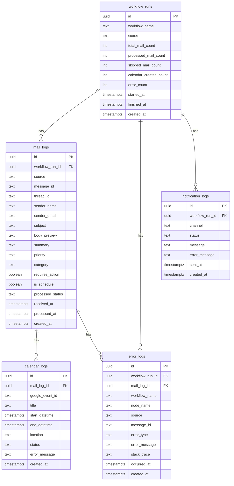

# DB設計書

## 1. 概要

本ドキュメントでは、AIメールアシスタントで使用するSupabase / PostgreSQLのDB設計を定義する。

本システムでは、GmailおよびOutlookから取得したメールの処理結果、Google Calendar登録結果、エラー情報、LINE通知結果を保存する。

MVPではWeb管理画面を作成しないため、SupabaseのTable EditorまたはSQL Editorを使って処理履歴を確認する。

---

## 2. 使用DB

| 項目 | 内容 |
|---|---|
| DB | Supabase PostgreSQL |
| 主な用途 | 処理ログ保存、重複処理防止、エラーログ保存 |
| 接続元 | n8n |
| 認証方式 | Supabase API Key または PostgreSQL接続 |
| タイムゾーン | UTC保存、表示時にJST変換 |

---

## 3. 設計方針

### 3.1 基本方針

- メール本文そのものは原則保存しない
- 保存するのは要約、件名、差出人、処理結果を中心とする
- 重複処理防止は `source + message_id` で行う
- 1回のワークフロー実行単位を `workflow_runs` に保存する
- メールごとの処理結果を `mail_logs` に保存する
- Google Calendar登録結果を `calendar_logs` に保存する
- エラー内容を `error_logs` に保存する
- LINE通知結果を `notification_logs` に保存する

### 3.2 メール本文を保存しない理由

メール本文には個人情報や機密情報が含まれる可能性があるため、MVPでは全文保存しない。

ただし、デバッグ用に本文の一部のみを `body_preview` として保存可能にする。

---

## 4. テーブル一覧

| テーブル名 | 用途 |
|---|---|
| workflow_runs | n8nワークフローの実行単位ログ |
| mail_logs | メールごとの処理結果 |
| calendar_logs | Google Calendar登録結果 |
| error_logs | エラーログ |
| notification_logs | LINE通知結果 |

---

## 5. ER図



---

## 6. テーブル詳細

## 6.1 workflow_runs

### 概要

n8nワークフロー1回分の実行結果を保存する。

### 用途

- 実行履歴の確認
- 処理件数の確認
- エラー件数の確認
- LINE通知単位との紐付け

### カラム定義

| カラム名 | 型 | NULL | 説明 |
|---|---|---|---|
| id | uuid | NO | 主キー |
| workflow_name | text | NO | ワークフロー名 |
| status | text | NO | 実行ステータス |
| total_mail_count | integer | NO | 取得メール数 |
| processed_mail_count | integer | NO | 処理済みメール数 |
| skipped_mail_count | integer | NO | 重複等でスキップした件数 |
| calendar_created_count | integer | NO | カレンダー登録件数 |
| error_count | integer | NO | エラー件数 |
| started_at | timestamptz | NO | 実行開始日時 |
| finished_at | timestamptz | YES | 実行終了日時 |
| created_at | timestamptz | NO | 作成日時 |

### status

| 値 | 意味 |
|---|---|
| running | 実行中 |
| success | 正常終了 |
| partial_success | 一部失敗 |
| failed | 失敗 |

---

## 6.2 mail_logs

### 概要

メール1件ごとの処理結果を保存する。

### 用途

- 処理済みメールの判定
- 要約結果の保存
- 重要度・カテゴリの保存
- カレンダー登録対象かどうかの保存

### カラム定義

| カラム名 | 型 | NULL | 説明 |
|---|---|---|---|
| id | uuid | NO | 主キー |
| workflow_run_id | uuid | YES | workflow_runs.id |
| source | text | NO | gmail または outlook |
| message_id | text | NO | メールサービス上のメールID |
| thread_id | text | YES | スレッドID |
| sender_name | text | YES | 差出人名 |
| sender_email | text | YES | 差出人メールアドレス |
| subject | text | YES | 件名 |
| body_preview | text | YES | 本文の一部 |
| summary | text | YES | AI要約 |
| priority | text | YES | 重要度 |
| category | text | YES | カテゴリ |
| requires_action | boolean | NO | 対応が必要か |
| is_schedule | boolean | NO | 予定メールか |
| processed_status | text | NO | 処理状態 |
| error_message | text | YES | エラー内容 |
| received_at | timestamptz | YES | メール受信日時 |
| processed_at | timestamptz | YES | 処理日時 |
| created_at | timestamptz | NO | 作成日時 |

### source

| 値 | 意味 |
|---|---|
| gmail | Gmail |
| outlook | Outlook |

### priority

| 値 | 意味 |
|---|---|
| High | 重要・緊急 |
| Medium | 通常確認 |
| Low | 低重要度 |

### category

| 値 | 意味 |
|---|---|
| schedule | 予定 |
| task | 作業依頼 |
| notice | 通知 |
| invoice | 請求 |
| promotion | 広告 |
| other | その他 |

### processed_status

| 値 | 意味 |
|---|---|
| processed | 正常処理済み |
| skipped | 重複等でスキップ |
| failed | 処理失敗 |
| pending | 未処理 |

---

## 6.3 calendar_logs

### 概要

Google Calendarへの予定登録結果を保存する。

### 用途

- 予定登録済みかどうかの確認
- Google CalendarのイベントID管理
- 登録失敗時のエラー確認

### カラム定義

| カラム名 | 型 | NULL | 説明 |
|---|---|---|---|
| id | uuid | NO | 主キー |
| mail_log_id | uuid | NO | mail_logs.id |
| google_event_id | text | YES | Google CalendarイベントID |
| title | text | NO | 予定タイトル |
| start_datetime | timestamptz | NO | 開始日時 |
| end_datetime | timestamptz | NO | 終了日時 |
| location | text | YES | 場所 |
| description | text | YES | 説明 |
| status | text | NO | 登録状態 |
| error_message | text | YES | エラー内容 |
| created_at | timestamptz | NO | 作成日時 |

### status

| 値 | 意味 |
|---|---|
| created | 登録成功 |
| failed | 登録失敗 |
| skipped | 登録対象外 |

---

## 6.4 error_logs

### 概要

ワークフロー実行中に発生したエラーを保存する。

### 用途

- 障害調査
- APIエラーの確認
- 失敗ノードの特定

### カラム定義

| カラム名 | 型 | NULL | 説明 |
|---|---|---|---|
| id | uuid | NO | 主キー |
| workflow_run_id | uuid | YES | workflow_runs.id |
| mail_log_id | uuid | YES | mail_logs.id |
| workflow_name | text | YES | ワークフロー名 |
| node_name | text | YES | エラー発生ノード |
| source | text | YES | gmail / outlook |
| message_id | text | YES | 対象メールID |
| error_type | text | YES | エラー種別 |
| error_message | text | NO | エラー内容 |
| stack_trace | text | YES | スタックトレース |
| occurred_at | timestamptz | NO | 発生日時 |
| created_at | timestamptz | NO | 作成日時 |

### error_type

| 値 | 意味 |
|---|---|
| gmail_error | Gmail取得エラー |
| outlook_error | Outlook取得エラー |
| openai_error | OpenAI APIエラー |
| calendar_error | Google Calendar登録エラー |
| line_error | LINE通知エラー |
| supabase_error | Supabase保存エラー |
| validation_error | データ検証エラー |
| unknown_error | その他 |

---

## 6.5 notification_logs

### 概要

LINE通知の送信結果を保存する。

### 用途

- 通知成功・失敗の確認
- 送信内容の確認
- ワークフロー実行単位との紐付け
- JST日付単位でのLINE日次通知の重複防止

### カラム定義

| カラム名 | 型 | NULL | 説明 |
|---|---|---|---|
| id | uuid | NO | 主キー |
| workflow_run_id | uuid | YES | workflow_runs.id |
| digest_date | date | YES | 日次通知の対象日（Asia/Tokyo） |
| channel | text | NO | 通知先 |
| status | text | NO | 送信状態 |
| message | text | YES | 送信メッセージ |
| error_message | text | YES | エラー内容 |
| sent_at | timestamptz | YES | 送信日時 |
| created_at | timestamptz | NO | 作成日時 |

### channel

| 値 | 意味 |
|---|---|
| line | LINE |

### status

| 値 | 意味 |
|---|---|
| sent | 送信成功 |
| failed | 送信失敗 |
| skipped | 送信対象外 |

---

## 7. 制約

## 7.1 一意制約

同じメールを複数回処理しないため、`mail_logs` には以下の一意制約を設定する。

```sql
UNIQUE (source, message_id)
```

LINE日次ダイジェストは、送信成功した同一日付の通知を重複させない。

```sql
UNIQUE (channel, digest_date)
WHERE channel = 'line' AND status = 'sent' AND digest_date IS NOT NULL
```

---

## 7.2 外部キー制約

| テーブル | カラム | 参照先 |
|---|---|---|
| mail_logs | workflow_run_id | workflow_runs.id |
| calendar_logs | mail_log_id | mail_logs.id |
| error_logs | workflow_run_id | workflow_runs.id |
| error_logs | mail_log_id | mail_logs.id |
| notification_logs | workflow_run_id | workflow_runs.id |

---

## 7.3 CHECK制約

想定外の値が入らないように、以下のカラムにはCHECK制約を設定する。

- workflow_runs.status
- mail_logs.source
- mail_logs.priority
- mail_logs.category
- mail_logs.processed_status
- calendar_logs.status
- error_logs.error_type
- notification_logs.channel
- notification_logs.status

---

## 8. インデックス設計

| テーブル | インデックス | 用途 |
|---|---|---|
| mail_logs | source, message_id | 重複判定 |
| mail_logs | received_at | 受信日時検索 |
| mail_logs | priority | 重要度検索 |
| mail_logs | category | カテゴリ検索 |
| calendar_logs | mail_log_id | メールログとの結合 |
| error_logs | occurred_at | エラー発生日検索 |
| notification_logs | workflow_run_id | 実行単位での通知確認 |
| notification_logs | channel, digest_date | LINE日次通知の重複防止 |

---

## 9. DDL

MVP初期構築時は以下のSQLをSupabase SQL Editorで実行する。

```sql
create extension if not exists "pgcrypto";

create table if not exists workflow_runs (
  id uuid primary key default gen_random_uuid(),
  workflow_name text not null,
  status text not null default 'running',
  total_mail_count integer not null default 0,
  processed_mail_count integer not null default 0,
  skipped_mail_count integer not null default 0,
  calendar_created_count integer not null default 0,
  error_count integer not null default 0,
  started_at timestamptz not null default now(),
  finished_at timestamptz,
  created_at timestamptz not null default now(),
  constraint workflow_runs_status_check
    check (status in ('running', 'success', 'partial_success', 'failed'))
);

create table if not exists mail_logs (
  id uuid primary key default gen_random_uuid(),
  workflow_run_id uuid references workflow_runs(id) on delete set null,
  source text not null,
  message_id text not null,
  thread_id text,
  sender_name text,
  sender_email text,
  subject text,
  body_preview text,
  summary text,
  priority text,
  category text,
  requires_action boolean not null default false,
  is_schedule boolean not null default false,
  processed_status text not null default 'pending',
  error_message text,
  received_at timestamptz,
  processed_at timestamptz,
  created_at timestamptz not null default now(),
  constraint mail_logs_source_check
    check (source in ('gmail', 'outlook')),
  constraint mail_logs_priority_check
    check (priority is null or priority in ('High', 'Medium', 'Low')),
  constraint mail_logs_category_check
    check (category is null or category in ('schedule', 'task', 'notice', 'invoice', 'promotion', 'other')),
  constraint mail_logs_processed_status_check
    check (processed_status in ('processed', 'skipped', 'failed', 'pending')),
  constraint mail_logs_source_message_id_unique
    unique (source, message_id)
);

create table if not exists calendar_logs (
  id uuid primary key default gen_random_uuid(),
  mail_log_id uuid not null references mail_logs(id) on delete cascade,
  google_event_id text,
  title text not null,
  start_datetime timestamptz not null,
  end_datetime timestamptz not null,
  location text,
  description text,
  status text not null default 'created',
  error_message text,
  created_at timestamptz not null default now(),
  constraint calendar_logs_status_check
    check (status in ('created', 'failed', 'skipped'))
);

create table if not exists error_logs (
  id uuid primary key default gen_random_uuid(),
  workflow_run_id uuid references workflow_runs(id) on delete set null,
  mail_log_id uuid references mail_logs(id) on delete set null,
  workflow_name text,
  node_name text,
  source text,
  message_id text,
  error_type text,
  error_message text not null,
  stack_trace text,
  occurred_at timestamptz not null default now(),
  created_at timestamptz not null default now(),
  constraint error_logs_error_type_check
    check (
      error_type is null
      or error_type in (
        'gmail_error',
        'outlook_error',
        'openai_error',
        'calendar_error',
        'line_error',
        'supabase_error',
        'validation_error',
        'unknown_error'
      )
    )
);

create table if not exists notification_logs (
  id uuid primary key default gen_random_uuid(),
  workflow_run_id uuid references workflow_runs(id) on delete set null,
  channel text not null default 'line',
  status text not null default 'sent',
  message text,
  error_message text,
  sent_at timestamptz,
  created_at timestamptz not null default now(),
  constraint notification_logs_channel_check
    check (channel in ('line')),
  constraint notification_logs_status_check
    check (status in ('sent', 'failed', 'skipped'))
);

create index if not exists idx_mail_logs_source_message_id
  on mail_logs(source, message_id);

create index if not exists idx_mail_logs_received_at
  on mail_logs(received_at);

create index if not exists idx_mail_logs_priority
  on mail_logs(priority);

create index if not exists idx_mail_logs_category
  on mail_logs(category);

create index if not exists idx_calendar_logs_mail_log_id
  on calendar_logs(mail_log_id);

create index if not exists idx_error_logs_occurred_at
  on error_logs(occurred_at);

create index if not exists idx_notification_logs_workflow_run_id
  on notification_logs(workflow_run_id);
```

---

## 10. RLS方針

## 10.1 MVPでの方針

MVPでは、n8nからサーバー側処理としてDBへアクセスする。

そのため、Web画面から一般ユーザーが直接DBへアクセスする構成にはしない。

### MVP方針

- SupabaseのService Role Keyは外部公開しない
- `.env` やn8n Credentialsで管理する
- GitHubには絶対にコミットしない
- Webクライアントから直接DBへアクセスしない

---

## 10.2 将来Web画面を作る場合

将来的にWebダッシュボードを作る場合は、RLSを有効化し、ユーザーごとにデータを分離する。

その場合は以下を追加する。

- usersテーブル
- user_idカラム
- Supabase Auth
- RLS Policy
- ユーザー単位のアクセス制御

MVPでは単一ユーザー運用のため、ユーザー分離は対象外とする。

---

## 11. 重複処理防止設計

## 11.1 判定キー

以下の組み合わせで重複を判定する。

```text
source + message_id
```

例：

| source | message_id |
|---|---|
| gmail | 18a9xxxxx |
| outlook | AAMkAGxxxxx |

GmailとOutlookではID体系が異なるため、`message_id` 単体ではなく `source` と組み合わせる。

---

## 11.2 判定SQL

```sql
select id
from mail_logs
where source = 'gmail'
  and message_id = 'target-message-id'
limit 1;
```

レコードが存在する場合、そのメールは処理済みとしてスキップする。

---

## 12. 保存例

## 12.1 mail_logs

```json
{
  "source": "gmail",
  "message_id": "18a9xxxxx",
  "thread_id": "18a9threadxxxxx",
  "sender_name": "A社 担当者",
  "sender_email": "user@example.com",
  "subject": "打ち合わせ日程について",
  "body_preview": "来週の打ち合わせについて...",
  "summary": "A社との打ち合わせ日程調整に関するメール。",
  "priority": "High",
  "category": "schedule",
  "requires_action": true,
  "is_schedule": true,
  "processed_status": "processed",
  "received_at": "2026-07-12T08:00:00+09:00",
  "processed_at": "2026-07-12T08:01:00+09:00"
}
```

---

## 12.2 calendar_logs

```json
{
  "google_event_id": "google-calendar-event-id",
  "title": "A社打ち合わせ",
  "start_datetime": "2026-07-15T10:00:00+09:00",
  "end_datetime": "2026-07-15T11:00:00+09:00",
  "location": "オンライン",
  "status": "created"
}
```

---

## 13. 運用時の確認SQL

## 13.1 直近の処理履歴

```sql
select
  source,
  sender_email,
  subject,
  summary,
  priority,
  category,
  processed_status,
  received_at,
  processed_at
from mail_logs
order by processed_at desc
limit 50;
```

---

## 13.2 重要メールのみ確認

```sql
select
  source,
  sender_email,
  subject,
  summary,
  received_at
from mail_logs
where priority = 'High'
order by received_at desc;
```

---

## 13.3 カレンダー登録済みメール

```sql
select
  m.source,
  m.subject,
  c.title,
  c.start_datetime,
  c.status
from calendar_logs c
join mail_logs m on m.id = c.mail_log_id
order by c.start_datetime desc;
```

---

## 13.4 エラー確認

```sql
select
  workflow_name,
  node_name,
  error_type,
  error_message,
  occurred_at
from error_logs
order by occurred_at desc
limit 50;
```

---

## 14. バックアップ方針

MVPではSupabaseの標準機能を利用する。

将来的には以下を検討する。

- 定期バックアップ
- CSVエクスポート
- ログ保存期間の設定
- 古いログの自動削除

---

## 15. データ保持方針

### MVP

- メール本文全文は保存しない
- 要約と処理結果は保存する
- エラーログは保存する
- LINE通知本文は保存する

### 将来対応

- 古いログを自動削除
- 保存期間を30日 / 90日などに設定
- 個人情報を含むログのマスキング

---

## 16. MVPで作成するテーブル

MVPでは以下の5テーブルを作成する。

```text
workflow_runs
mail_logs
calendar_logs
error_logs
notification_logs
```

---

## 17. 今後の拡張候補

将来的には以下のテーブル追加を検討する。

| テーブル名 | 用途 |
|---|---|
| users | 複数ユーザー対応 |
| user_integrations | Gmail / Outlook / LINEなどの連携情報 |
| tasks | メールから抽出したTODO管理 |
| attachment_logs | 添付ファイル解析結果 |
| prompt_versions | AIプロンプトのバージョン管理 |
| daily_reports | 日次サマリー保存 |
